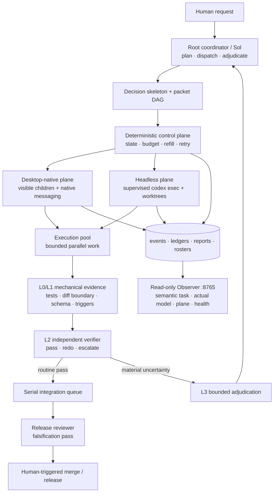
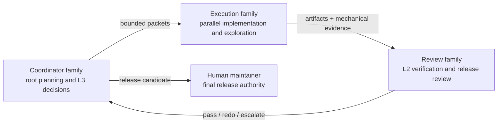

<!-- size-justified: project landing page; raw logs and generated state are excluded. -->
<div align="center">

# Codex LOOP Orchestra

**Multi-model, dual-plane orchestration and observability for high-concurrency Codex agents.**

[](https://github.com/LEO001020/codex-loop-orchestra/actions/workflows/ci.yml)
[](LICENSE)
[](https://www.python.org/)
[](https://learn.chatgpt.com/docs/agent-configuration/subagents)

[中文](README.zh-CN.md) · [Installation](INSTALL.md) · [Security](SECURITY.md) · [Contributing](CONTRIBUTING.md)

</div>

> [!IMPORTANT]
> Codex LOOP Orchestra is an independent community project. It is not an OpenAI product and is not affiliated with, sponsored by, or endorsed by OpenAI. It uses documented Codex configuration, custom agents, lifecycle hooks, and `codex exec`; it does not distribute or patch Codex binaries.

## Why LOOP exists

Codex already provides subagents and root-to-child communication. LOOP preserves those capabilities and adds a sustained control and observation layer:

- **Keep the root chat on coordination.** The root plans, dispatches, adjudicates genuine anomalies, and integrates. Workers or deterministic scripts handle searching, testing, waiting, polling, counting, and routine retries.
- **Refill useful parallel work continuously.** A one-shot batch decays as children finish. LOOP tracks effective concurrency and refills available slots while real bounded work remains.
- **Reduce correlated model errors.** Execution, L2 verification, and release review use explicit role/model/effort pins. Production deployments can place the root, execution pool, and review layers on three independent model families or providers.
- **Make child identity operationally useful.** LOOP replaces random English nickname candidates with ordered `task_01`–`task_50` identifiers. The Observer adds a semantic mapping because Codex Desktop does not expose the complete delegated objective as the native nickname.
- **Separate the control and execution planes.** The maintainers observed conversation-layer or application instability near 10–20 busy Desktop children in their environment. LOOP can keep Desktop light and move wide waves to supervised headless workers. This is a maintainer-observed motivation, not a universal Codex product claim.

LOOP measures a target of **at most 25% root-model effective production tokens**. This is a control target, not a universal cost, quality, or latency guarantee.

## What LOOP adds

| Capability | Implementation |
|---|---|
| Sustained concurrency | Configurable target of 20 active workers per parent task and an 80-worker cross-plane envelope |
| Desktop + headless | Visible native children plus supervised `codex exec` workers |
| Continuous refill | Completed, failed, or lost slots are replaced while eligible work remains |
| Model separation | Explicit execution and review pins; the user retains control of the root model |
| Deterministic control | Packet DAG, state machine, retry classes, lifecycle rosters, and dead letters |
| Layered verification | Mechanical L0/L1 checks, independent L2 verification, bounded L3 adjudication, human L4 release |
| Human-readable operations | Ordered native nicknames plus semantic task/model/plane mapping on port 8765 |
| Reversible global mode | Activate, deactivate, inspect status, and restore verified backups |

The 20/80 values are LOOP operating targets. They are not official Codex limits. The configured Codex per-session child ceiling is 50.

## Architecture



The model roles are an orchestra rather than a monoculture:



The portable profile works without a private gateway. A production profile can reference provider-routed model IDs that the user has already configured; credentials always remain outside this repository.

## Observer


The screenshot is from the maintainer's provider-routed deployment; model-chip
labels are profile-specific. The public Observer derives execution/review labels
from the active portable profile.

The Desktop pane shows ordered native names such as `task_39`. The read-only Observer associates those identities with semantic task names and displays observed model, execution plane, lifecycle freshness, configured capacity, and gateway health. It reads lifecycle and rollout evidence; it does not schedule work or authorize releases.

## Agent-first installation

The recommended installation is **agent-assisted but script-controlled**. Give the repository to Codex or another coding agent and ask it to follow [AGENT_INSTALL.md](AGENT_INSTALL.md):

```text
Read AGENT_INSTALL.md. Ask whether I want 中文 or English first.
Inspect my environment without writing, run the supported dry-run, and explain
every planned change and backup. Wait for my confirmation, then call only the
repository's deterministic installer and verify the result. Do not read,
print, or modify API credentials.
```

The agent discovers the actual environment and explains the operation. Deterministic PowerShell, Python, and Bash code performs installation and restoration. Manual commands remain available.

### Requirements

- Codex CLI with subagents and hooks support; authenticate with `codex login`
- Python 3.11+
- Node.js 22+
- Git 2.40+
- PowerShell on Windows, or Bash on Linux/WSL

### Windows

```powershell
git clone https://github.com/LEO001020/codex-loop-orchestra.git
cd codex-loop-orchestra
./launchers/Set-Codex-LOOP-Mode.ps1 -Mode Activate
```

Activation installs the portable custom agents, merges only supported Codex multi-agent settings, backs up managed files, renders absolute hook paths, and activates global LOOP mode. Fully restart Codex Desktop and create a new task.

```powershell
# Optional: start a workspace and the Observer
./launchers/Start-Codex-LOOP-Desktop.ps1 -TargetWorkspace C:\path\to\repo
./launchers/Start-Codex-LOOP-Monitor.ps1

# Pause without removing the verified backup
./launchers/Set-Codex-LOOP-Mode.ps1 -Mode Deactivate

# Restore the pre-install managed files
./launchers/Set-Codex-LOOP-Mode.ps1 -Mode Restore
```

### Linux / WSL

```bash
git clone https://github.com/LEO001020/codex-loop-orchestra.git
cd codex-loop-orchestra
./install.sh --repo "$PWD"
```

Restart Codex and create a new task. Restore the pre-activation managed files with:

```bash
./uninstall.sh
```

See [INSTALL.md](INSTALL.md) and [INSTALL.zh-CN.md](INSTALL.zh-CN.md) for isolated test installs, explicit `CODEX_HOME` handling, model profiles, headless prerequisites, and troubleshooting.

## Configuration authority

The installer merges only documented Codex settings from `config/config.toml.example`:

```toml
[features]
multi_agent = true

[agents]
enabled = true
max_concurrent_threads_per_session = 50
default_subagent_model = "gpt-5.6-terra"
default_subagent_reasoning_effort = "medium"
```

Official references: [Subagents](https://learn.chatgpt.com/docs/agent-configuration/subagents), [Hooks](https://learn.chatgpt.com/docs/hooks), and [Configuration Reference](https://learn.chatgpt.com/docs/config-file/config-reference).

| File | Authority |
|---|---|
| `config/model_profiles.toml` | Execution and independent-review model pins |
| `config/refill_policy.toml` | Parent/cross-plane targets, pacing, and low-water marks |
| `config/orchestration_policy_v2.toml` | Routing mode, budgets, governor, and family pins |
| `config/retry_classes.yaml` | Deterministic retry and dead-letter classification |
| `config/triggers_v2.yaml` | Mechanical escalation signals |
| `agents/*.toml` | Custom-agent instructions, sandbox, and ordered nickname candidates |

Inspect or switch a package-local profile without touching user credentials:

```bash
python harness/model_profile.py list --root .
python harness/model_profile.py set portable --root . --no-global --no-wsl
```

The `three-family-example` profile is intentionally inactive. Replace its placeholders with model IDs already available in your Codex or gateway setup, keep the root on a third independent family, and then activate it. The profile switcher never edits provider catalogs or credentials.

## Control loop

1. The root emits a bounded decision skeleton instead of doing bulk work.
2. Packets declare goal, authorized paths, acceptance commands, and constraints.
3. The DAG gate rejects cycles and overlapping write scopes before dispatch.
4. Desktop or headless workers run in isolated worktrees with explicit role/model/effort pins.
5. Scripts replay acceptance, validate diff boundaries, and emit typed lifecycle events.
6. L2 can pass, request a redo, rank alternatives, or escalate; it cannot release.
7. Only genuine anomalies return to the root. Final merge and release remain human-triggered.

Waiting, polling, tallying, ordinary retries, and state transitions are handled by scripts or the state machine, not by extra root-model turns.

## Repository layout

```text
agents/      custom Codex roles and ordered nickname candidates
config/      routing, concurrency, retry, trigger, and managed-hook policy
harness/     dispatch, state machine, refill, lifecycle, gates, and recovery
hooks/       Codex lifecycle enforcement and context injection
launchers/   Windows activation, Desktop startup, and Observer
metering/    per-role/model token attribution and budget signals
schemas/     packet and report contracts
scripts/     release packaging and integrity helpers
tests/       unit, state-path, installer, security, and orchestration tests
```

Runtime state belongs under `data/` and reports under `reports/`; both are ignored and must never be committed.

## Verification

```bash
python -m pytest tests -q
python scripts/gen_filelist.py .
python scripts/gen_sha256sums.py . --output SHA256SUMS
sha256sum -c SHA256SUMS
```

CI validates source/configuration syntax, instruction attention budgets, PowerShell parsing, isolated installers, managed-file closure, and secrets. Live provider routing is an explicit local smoke test because public CI has no user credentials.

## Security and limitations

- Hooks run as the current user and do not elevate privileges.
- Provider credentials remain in the user's authenticated Codex or gateway setup.
- Tool and spawn gates deny operations; they do not grant privileges.
- L1/L2 may block or escalate; only a human can publish.
- The 20/80 targets and 25% root-token target are configurable LOOP policy, not guarantees or official Codex limits.
- The current implementation is a single-machine control plane, not a distributed scheduler.

Report vulnerabilities privately as described in [SECURITY.md](SECURITY.md).

## History and license

The first LOOP design was developed independently before the current Codex harness surfaces were broadly available as open source. The public release builds on documented extension points instead of maintaining a Codex binary fork.

MIT © 2026 [LEO001020](https://github.com/LEO001020). See [LICENSE](LICENSE), [CONTRIBUTING.md](CONTRIBUTING.md), and [THIRD_PARTY_NOTICES.md](THIRD_PARTY_NOTICES.md).
