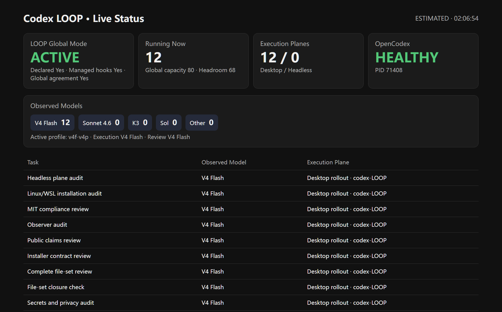
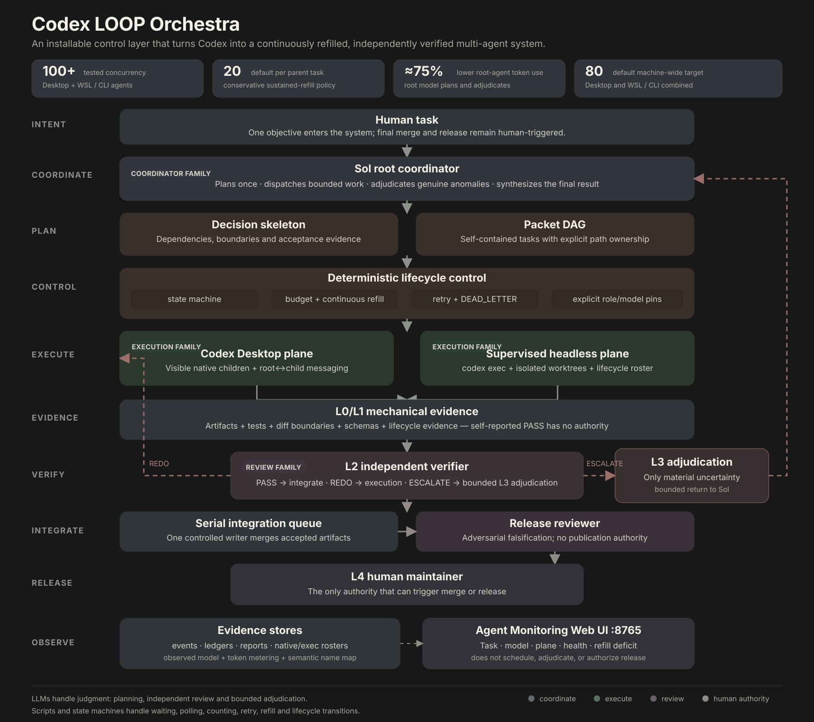

<!-- size-justified: project landing page; raw logs and generated state are excluded. -->
<div align="center">

# Codex LOOP Orchestra

**The control loop that keeps a high-concurrency Codex team running.**

[](https://github.com/LEO001020/codex-loop-orchestra/actions/workflows/ci.yml)
[](LICENSE)
[](https://www.python.org/)
[](https://learn.chatgpt.com/docs/agent-configuration/subagents)

[Control loop](#the-control-loop-is-the-product) · [Quickstart](#quickstart) · [Why LOOP](#why-loop-exists) · [Architecture](#how-loop-works) · [中文](README.zh-CN.md) · [Docs](INSTALL.md)

</div>

Codex can launch parallel subagents. LOOP turns them into a continuously refilled engineering system.

The root decides; workers execute across Desktop and supervised WSL/headless planes; independent models review; scripts own routine state; the Observer shows what is actually running.



<p align="center"><sub>One live view for every native and headless agent: task, model, execution plane, health, and capacity.</sub></p>

## The control loop is the product

Many harnesses can start agents. LOOP's product is the bounded control loop that keeps a wide team replenished while useful work and capacity remain, with isolated writes, reproducible acceptance, and human release authority:

1. The root emits a bounded decision skeleton instead of doing bulk work.
2. Every task packet declares its goal, authorized paths, acceptance commands, and constraints.
3. The dependency-graph (DAG) gate rejects cycles and overlapping write scopes before dispatch.
4. Desktop or headless workers run in isolated Git worktrees with explicit role, model, and reasoning-effort pins.
5. Scripts replay acceptance, validate diff boundaries, and emit typed lifecycle events.
6. L2 independent review may pass, request a redo, rank alternatives, or escalate; it cannot release.
7. Only genuine anomalies return to the root. Final merge and release remain human-triggered.
8. Waiting, polling, tallying, ordinary retries, and state transitions stay in scripts or the state machine—not extra root-model turns.

**Models make judgments. Code owns state. Independent reviewers challenge results. Humans release.**

## Quickstart

Give this repository to Codex or another coding agent and paste:

```text
Install Codex LOOP Orchestra from https://github.com/LEO001020/codex-loop-orchestra.
Read AGENT_INSTALL.md first. Inspect my environment, show the dry-run and backups,
wait for my approval, then activate LOOP and verify the installation.
Never read, print, or change my API credentials.
```

Prefer to install manually? Jump to [Installation details](#installation-details), or read the complete [Windows/Linux/WSL guide](INSTALL.md).

## Why LOOP exists

The goal is not merely to start more agents. LOOP addresses the failure modes that appear when a native agent harness is pushed into sustained, wide, multi-model engineering work:

| Codex / harness gap | LOOP design | Advantage |
|---|---|---|
| A launched wave drains as agents finish; a prompt is not a refill policy. | Count real Desktop/headless workers and refill from a bounded backlog. | **Keep high concurrency running** without repeated user prompts. |
| Execution and self-review by one model family can share blind spots. | Keep the root user-selected; pin executor and auditor roles to different Codex/OpenCodex models. | **Catch correlated mistakes** with independent model families. |
| A wide native wave shares Desktop's conversation transport. | Keep visible native agents; move wider execution to supervised WSL/headless workers. | **Gain parallel headroom** without losing root-child messaging. |
| Tool calls repeatedly rebuild parsed data and intermediate computation. | Give headless workers an optional, lazy, session-scoped IPybox Python kernel. | **Continue across calls** with files, dataframes, indexes, and counters intact. |
| The coordinator can waste high-tier turns on search, tests, polling, and retries. | Let the root plan and adjudicate while scripts own deterministic lifecycle work. | **Spend the best model on decisions** and govern root production-token share toward ≤25%. |
| Native nicknames and separate headless processes do not form one operational view. | Use ordered numeric IDs and map them to semantic tasks, models, planes, health, and capacity. | **See every agent live** and diagnose refill deficits from one Observer. |

Default LOOP policy targets 20 active agents per parent task and 80 across one machine. These are configurable targets bounded by useful work, provider capacity, and hardware—not official Codex limits or performance guarantees.

The dual-plane design came from maintainer-observed Desktop conversation instability around 10–20 busy children in one environment. That is a design origin, not a published benchmark or an official Codex limit.

## How LOOP works



The architecture separates decision, execution, review, deterministic control, and release authority across two observable execution planes.

### A persistent Python workbench for the harness

WSL is also LOOP's persistent tool plane. The public package includes a lazy IPybox server, sandbox policy, and WSL/headless routing rules; once the optional upstream MCP is registered, execution workers can keep dataframes, parsed indexes, counters, and other Python state across calls, digest large output outside the model context, and leave Desktop as the light control plane.

> [!NOTE]
> Codex LOOP Orchestra is an independent community project, not an OpenAI product. It installs configuration, custom agents, lifecycle hooks, and `codex exec` tooling; it does not distribute or patch Codex binaries. The portable profile needs no private gateway, and credentials remain outside the repository.

## Installation details

The recommended path is **agent-assisted but script-controlled**. [AGENT_INSTALL.md](AGENT_INSTALL.md) makes the agent inventory the environment, show a dry-run and backup plan, wait for approval, and then call the same deterministic installer used below. PowerShell, Python, and Bash perform the actual installation and restoration.

### Requirements

- Codex CLI with subagents and hooks support; authenticate with `codex login`
- Python 3.11+
- Node.js 22+
- Git 2.40+
- PowerShell on Windows, or Bash on Linux/WSL

### Windows

```powershell
git clone https://github.com/LEO001020/codex-loop-orchestra.git
cd codex-loop-orchestra
./launchers/Set-Codex-LOOP-Mode.ps1 -Mode Activate
```

Activation installs the portable custom agents, merges only supported Codex multi-agent settings, backs up managed files, renders absolute hook paths, and activates global LOOP mode. Fully restart Codex Desktop and create a new task.

```powershell
# Optional: start a workspace and the Observer
./launchers/Start-Codex-LOOP-Desktop.ps1 -TargetWorkspace C:\path\to\repo
./launchers/Start-Codex-LOOP-Monitor.ps1

# Pause without removing the verified backup
./launchers/Set-Codex-LOOP-Mode.ps1 -Mode Deactivate

# Restore the pre-install managed files
./launchers/Set-Codex-LOOP-Mode.ps1 -Mode Restore
```

### Linux / WSL

```bash
git clone https://github.com/LEO001020/codex-loop-orchestra.git
cd codex-loop-orchestra
./install.sh --repo "$PWD"
```

Restart Codex and create a new task. Restore the pre-activation managed files with:

```bash
./uninstall.sh
```

See [INSTALL.md](INSTALL.md) and [INSTALL.zh-CN.md](INSTALL.zh-CN.md) for isolated test installs, explicit `CODEX_HOME` handling, model profiles, headless prerequisites, and troubleshooting.

## Configuration authority

The installer merges only documented Codex settings from `config/config.toml.example`:

```toml
[features]
multi_agent = true

[agents]
enabled = true
max_concurrent_threads_per_session = 50
default_subagent_model = "gpt-5.6-terra"
default_subagent_reasoning_effort = "medium"
```

Official references: [Subagents](https://learn.chatgpt.com/docs/agent-configuration/subagents), [Hooks](https://learn.chatgpt.com/docs/hooks), and [Configuration Reference](https://learn.chatgpt.com/docs/config-file/config-reference).

| File | Authority |
|---|---|
| `config/model_profiles.toml` | Execution and independent-review model pins |
| `config/refill_policy.toml` | Parent/cross-plane targets, pacing, and low-water marks |
| `config/orchestration_policy_v2.toml` | Routing mode, budgets, governor, and family pins |
| `config/retry_classes.yaml` | Deterministic retry and dead-letter classification |
| `config/triggers_v2.yaml` | Mechanical escalation signals |
| `agents/*.toml` | Custom-agent instructions, sandbox, and ordered nickname candidates |

Inspect or switch a package-local profile without touching user credentials:

```bash
python harness/model_profile.py list --root .
python harness/model_profile.py set portable --root . --no-global --no-wsl
```

Root, executor, and auditor models do not have to be GPT models: keep the user-selected root on any model exposed by Codex/OpenCodex, then pin execution and review to any other available model IDs through the profile. The `three-family-example` profile is intentionally inactive; the switcher never edits provider catalogs or credentials.

## Repository layout

```text
agents/      custom Codex roles and ordered nickname candidates
config/      routing, concurrency, retry, trigger, and managed-hook policy
harness/     dispatch, state machine, refill, lifecycle, gates, and recovery
hooks/       Codex lifecycle enforcement and context injection
launchers/   Windows activation, Desktop startup, and Observer
metering/    per-role/model token attribution and budget signals
schemas/     packet and report contracts
scripts/     release packaging and integrity helpers
tests/       unit, state-path, installer, security, and orchestration tests
```

Runtime state belongs under `data/` and reports under `reports/`; both are ignored and must never be committed.

## Verification

```bash
python -m pytest tests -q
python scripts/gen_filelist.py .
python scripts/gen_sha256sums.py . --output SHA256SUMS
sha256sum -c SHA256SUMS
```

CI validates source/configuration syntax, instruction attention budgets, PowerShell parsing, isolated installers, managed-file closure, and secrets. Live provider routing is an explicit local smoke test because public CI has no user credentials.

## Security and limitations

- Hooks run as the current user and do not elevate privileges.
- Provider credentials remain in the user's authenticated Codex or gateway setup.
- Tool and spawn gates deny operations; they do not grant privileges.
- L1/L2 may block or escalate; only a human can publish.
- The 20/80 targets and 25% root-token target are configurable LOOP policy, not guarantees or official Codex limits.
- The current implementation is a single-machine control plane, not a distributed scheduler.

Report vulnerabilities privately as described in [SECURITY.md](SECURITY.md).

## History and license

The first LOOP design was developed independently before the current Codex harness surfaces were broadly available as open source. The public release builds on documented extension points instead of maintaining a Codex binary fork.

MIT © 2026 [LEO001020](https://github.com/LEO001020). See [LICENSE](LICENSE), [CONTRIBUTING.md](CONTRIBUTING.md), and [THIRD_PARTY_NOTICES.md](THIRD_PARTY_NOTICES.md).
