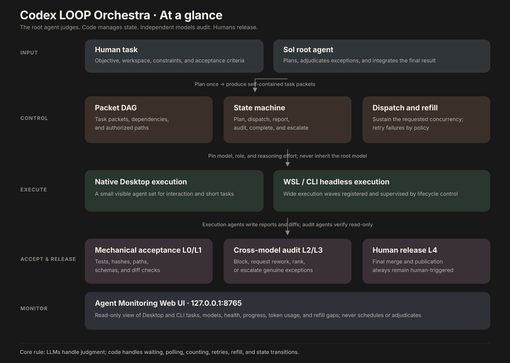

<!-- size-justified: project landing page; raw logs and generated state are excluded. -->
<div align="center">

# Codex LOOP Orchestra

**The control loop that keeps an engineering team of 100+ Codex agents running.**

[](https://github.com/LEO001020/codex-loop-orchestra/actions/workflows/ci.yml)
[](LICENSE)
[](https://www.python.org/)
[](https://learn.chatgpt.com/docs/agent-configuration/subagents)

[Highlights](#highlights) · [Control loop](#the-control-loop-is-the-product) · [Quickstart](#quickstart) · [Why LOOP](#why-loop-exists) · [Architecture](#how-loop-works) · [中文](README.zh-CN.md) · [Docs](INSTALL.md)

</div>

Codex can launch subagents in parallel. LOOP adds the scheduling, isolation, independent audit, and observability needed to turn a one-shot batch into a self-replenishing engineering system.

Give LOOP a goal and a concurrency target. It breaks the work into tasks, dispatches them, and fills each newly available slot until the backlog is empty. Small workloads can remain visible in Codex Desktop; larger waves can run through supervised WSL headless workers. The root, execution, and audit stages can use models from different providers, while one dashboard shows what every agent is doing. You no longer have to keep asking the system to continue, and you retain final control over every merge.

## Highlights

- **Tested at 100+ concurrent agents:** LOOP delivers stable, hundred-agent concurrency on the widely used Codex harness by combining Desktop agents with supervised WSL/CLI workers.
- **Set the target once; LOOP keeps it filled:** LOOP measures the agents actually running and refills open slots until the bounded backlog is empty—no repeated “continue” prompts required.
- **Independent model choice at all three stages:** The root agent orchestrates, execution agents implement, and audit agents review. Each stage can use a different model provider, including third-party models exposed through a Codex-compatible gateway such as OpenCodex.
- **Root-agent orchestration with a DAG gate:** The root plans and adjudicates. Dependency and write-scope checks run before tasks enter isolated Git worktrees.
- **About 75% lower root-agent token use:** The root model no longer performs search, bulk execution, waiting, or routine retries. It spends its tokens on planning and adjudication instead.
- **WSL with an IPython/IPybox-style persistent compute container:** An on-demand Python kernel preserves DataFrames, indexes, and counters across calls and processes large files, datasets, and intermediate results outside the model context.
- **Desktop launches and supervises CLI concurrency:** Keep the root conversation and a small visible agent set in Desktop while supervised `codex exec` processes expand larger execution waves into the WSL headless runtime.
- **Agent Monitoring Web UI:** See every Desktop and CLI agent in one browser view, including its task name, observed model, runtime, health, refill deficit, and remaining capacity.



<p align="center"><sub>At a glance: the root agent judges, code sustains concurrency and state, independent models audit, and humans release.</sub></p>


<p align="center"><sub>One live view of every Desktop and headless agent: task, model, runtime, health, and available capacity.</sub></p>

## The control loop is the product

Many agent harnesses can start a batch of agents. LOOP solves the harder problem: keeping the requested concurrency level filled for as long as useful parallel work remains, while isolating writes, making acceptance reproducible, and reserving release authority for a human.

> **In plain language:** Set the goal and concurrency once. LOOP handles decomposition, dispatch, refill, and verification. When one agent finishes, another takes the open slot. Scripts handle routine waiting and retries; only exceptions that require judgment are escalated to the root agent.
>
> **What that means for you:** No more repeatedly typing “continue” or “start more agents.” Parallel execution reduces elapsed time, isolated worktrees prevent agents from overwriting one another, and an independent model audit helps catch shared blind spots.

The control loop enforces these rules:

1. The root agent produces a bounded plan and does not perform bulk execution itself.
2. Every task packet declares its goal, authorized paths, acceptance commands, and constraints.
3. A DAG gate rejects cyclic dependencies and overlapping write scopes before dispatch.
4. Desktop agents and headless workers run in isolated Git worktrees with an explicit role, model, and reasoning effort.
5. Scripts rerun acceptance commands, verify diff boundaries, and record typed lifecycle events.
6. The independent L2 audit stage may approve, request rework, rank alternatives, or escalate; it cannot publish.
7. Only exceptions that cannot be handled by policy return to the root agent. A human must trigger the final merge and release.
8. Scripts and state machines handle waiting, status checks, counts, routine retries, and state transitions without consuming additional root-model turns.

**Models make judgments. Code manages state. Independent models audit the work. Humans release it.**

## Quickstart

Give this repository to Codex or another coding agent and paste:

```text
Install Codex LOOP Orchestra from https://github.com/LEO001020/codex-loop-orchestra.
Read AGENT_INSTALL.md first. Inspect my environment, show the dry-run and backups,
wait for my approval, then activate LOOP and verify the installation.
Never read, print, or change my API credentials.
```

Prefer to install manually? Jump to [Installation details](#installation-details), or read the complete [Windows/Linux/WSL guide](INSTALL.md).

## Why LOOP exists

LOOP is not simply a way to start more agents. Each part of the system addresses a failure mode that appears when a native agent harness is used for sustained, high-concurrency, multi-model engineering:

| Limitation in the native harness | What LOOP changes | Practical benefit |
|---|---|---|
| A batch shrinks as agents finish; prompting alone does not reliably refill it. | Measure the agents actually running across Desktop and headless runtimes, then refill open slots from a bounded backlog. | **Sustain high concurrency** without repeated user intervention. |
| Execution and self-review by the same model family can preserve the same blind spots. | Treat the root, execution, and audit stages as independent model-routing decisions. Third-party models can connect through a Codex-compatible gateway such as OpenCodex. | **Cross-check work with different model families** and reduce correlated failures. |
| In the maintainer's environment, the Codex Desktop conversation layer became unstable and sometimes crashed with roughly 10–20 busy native subagents. | Keep a smaller visible set of Desktop agents and send larger execution waves to supervised WSL headless workers. | **Avoid the Desktop conversation-layer bottleneck** while preserving native root-to-subagent messaging. |
| Ordinary tool calls repeatedly reload files, parse data, and rebuild intermediate results. | Give headless workers an optional IPybox-backed Python kernel that starts on demand and persists for the session. | **Preserve computation across calls**, including DataFrames, indexes, and counters. |
| A high-capability coordinator can waste expensive turns on search, tests, waiting, polling, and retries. | Let the root agent plan and adjudicate while scripts handle deterministic lifecycle operations. | **Reserve the strongest model for decisions and reduce elapsed time.** Dozens of execution agents can raise aggregate throughput, particularly with Flash or diffusion- and draft-accelerated worker models, while policy keeps the root model's production-token share at or below 25%. |
| Native random nicknames and separate headless processes provide no unified operational view. | Assign ordered numeric IDs and map them to task names, models, runtimes, health, and remaining capacity. | **See every agent in real time** and diagnose refill gaps from the Agent Monitoring Web UI. |

LOOP has been tested with more than 100 concurrent agents. The public package ships with a more conservative default of 20 active agents per parent task and 80 across the Desktop and headless runtimes on one machine; users can raise those values to match the workload, model-provider capacity, and local hardware.

The 10–20 range is a maintainer observation from one environment that motivated the dual-plane design, not a published benchmark or an official Codex limit.

## How LOOP works


LOOP separates planning, execution, audit, state management, and release authority. The root agent plans and adjudicates; execution agents work in Desktop or WSL headless environments; audit agents review the results independently; scripts and state machines manage routine lifecycle state; and the Agent Monitoring Web UI combines both runtimes into one operational view. No agent can publish a release by itself.

### Persistent Python compute for headless workers

WSL also provides LOOP's persistent compute layer. The optional IPybox integration starts a Python kernel on demand and preserves DataFrames, parsed indexes, counters, and other state across calls. Headless workers can process large files, datasets, and intermediate results outside the model context instead of rebuilding them on every turn, while Codex Desktop remains a lightweight control and observation surface.

> [!NOTE]
> Codex LOOP Orchestra is an independent community project, not an OpenAI product. It installs configuration, custom agents, lifecycle hooks, and `codex exec` tooling; it does not distribute or patch Codex binaries. The portable profile needs no private gateway, and credentials remain outside the repository.

## Installation details

The recommended installation is **agent-guided and script-executed**. [AGENT_INSTALL.md](AGENT_INSTALL.md) instructs the agent to inspect the environment, show the proposed changes and backup plan, wait for approval, and then invoke the same deterministic installer documented below. PowerShell, Python, and Bash—not ad hoc model-generated commands—perform the actual installation and restoration.

### Requirements

- Codex CLI with subagents and hooks support; authenticate with `codex login`
- Python 3.11+
- Node.js 22+
- Git 2.40+
- PowerShell on Windows, or Bash on Linux/WSL

### Windows

```powershell
git clone https://github.com/LEO001020/codex-loop-orchestra.git
cd codex-loop-orchestra
./launchers/Set-Codex-LOOP-Mode.ps1 -Mode Activate
```

Activation installs the portable custom agents, merges only supported Codex multi-agent settings, backs up managed files, renders absolute hook paths, and activates global LOOP mode. Fully restart Codex Desktop and create a new task.

```powershell
# Optional: start a workspace and the Agent Monitoring Web UI
./launchers/Start-Codex-LOOP-Desktop.ps1 -TargetWorkspace C:\path\to\repo
./launchers/Start-Codex-LOOP-Monitor.ps1

# Pause without removing the verified backup
./launchers/Set-Codex-LOOP-Mode.ps1 -Mode Deactivate

# Restore the pre-install managed files
./launchers/Set-Codex-LOOP-Mode.ps1 -Mode Restore
```

### Linux / WSL

```bash
git clone https://github.com/LEO001020/codex-loop-orchestra.git
cd codex-loop-orchestra
./install.sh --repo "$PWD"
```

Restart Codex and create a new task. Restore the pre-activation managed files with:

```bash
./uninstall.sh
```

See [INSTALL.md](INSTALL.md) and [INSTALL.zh-CN.md](INSTALL.zh-CN.md) for isolated test installs, explicit `CODEX_HOME` handling, model profiles, headless prerequisites, and troubleshooting.

## Configuration and model routing

The installer merges only documented Codex settings from `config/config.toml.example`:

```toml
[features]
multi_agent = true

[agents]
enabled = true
max_concurrent_threads_per_session = 50
default_subagent_model = "gpt-5.6-terra"
default_subagent_reasoning_effort = "medium"
```

Official references: [Subagents](https://learn.chatgpt.com/docs/agent-configuration/subagents), [Hooks](https://learn.chatgpt.com/docs/hooks), and [Configuration Reference](https://learn.chatgpt.com/docs/config-file/config-reference).

| File | Purpose |
|---|---|
| `config/model_profiles.toml` | Models and reasoning effort for execution and audit agents |
| `config/refill_policy.toml` | Per-task and cross-runtime concurrency targets, launch pacing, and refill thresholds |
| `config/orchestration_policy_v2.toml` | Model routing, budgets, concurrency control, and model-family constraints |
| `config/retry_classes.yaml` | Deterministic retry rules and dead-letter classification |
| `config/triggers_v2.yaml` | Deterministic escalation conditions |
| `agents/*.toml` | Custom-agent instructions, sandbox permissions, and ordered numeric-name candidates |

Inspect or switch a package-local profile without touching user credentials:

```bash
python harness/model_profile.py list --root .
python harness/model_profile.py set portable --root . --no-global --no-wsl
```

The root, execution, and audit stages do not have to use GPT models. The root can use any model selected through Codex or OpenCodex, while the execution and audit stages can be pinned to other model IDs exposed by the gateway. The `three-family-example` profile is intentionally inactive. The profile switcher never edits provider catalogs or credentials.

## Repository layout

```text
agents/      custom Codex roles and ordered nickname candidates
config/      routing, concurrency, retry, trigger, and managed-hook policy
harness/     dispatch, state machine, refill, lifecycle, gates, and recovery
hooks/       Codex lifecycle enforcement and context injection
launchers/   Windows activation, Desktop startup, and Agent Monitoring Web UI
metering/    per-role/model token attribution and budget signals
schemas/     packet and report contracts
scripts/     release packaging and integrity helpers
tests/       unit, state-path, installer, security, and orchestration tests
```

Runtime state belongs under `data/` and reports under `reports/`; both are ignored and must never be committed.

## Verification

```bash
python -m pytest tests -q
python scripts/gen_filelist.py .
python scripts/gen_sha256sums.py . --output SHA256SUMS
sha256sum -c SHA256SUMS
```

CI validates source and configuration syntax, instruction-file attention budgets, PowerShell parsing, isolated installation, the completeness of the managed-file boundary, and accidental secret exposure. Live model-provider routing remains an explicit local smoke test because public CI has no user credentials.

## Security and limitations

- Hooks run as the current user and do not elevate privileges.
- Provider credentials remain in the user's authenticated Codex or gateway setup.
- Tool and spawn gates deny operations; they do not grant privileges.
- L1/L2 may block or escalate; only a human can publish.
- The 100+ agent concurrency and roughly 75% reduction in root-agent token use have both been tested. The public package ships with a more conservative 20/80 concurrency policy that users can adjust.
- The current implementation is a single-machine control plane, not a distributed scheduler.

Report vulnerabilities privately as described in [SECURITY.md](SECURITY.md).

## History and license

The original LOOP design predates the public release of the current Codex agent-harness implementation. This open-source version uses documented Codex extension points and does not maintain a fork of the Codex binary.

MIT © 2026 [LEO001020](https://github.com/LEO001020). See [LICENSE](LICENSE), [CONTRIBUTING.md](CONTRIBUTING.md), and [THIRD_PARTY_NOTICES.md](THIRD_PARTY_NOTICES.md).
