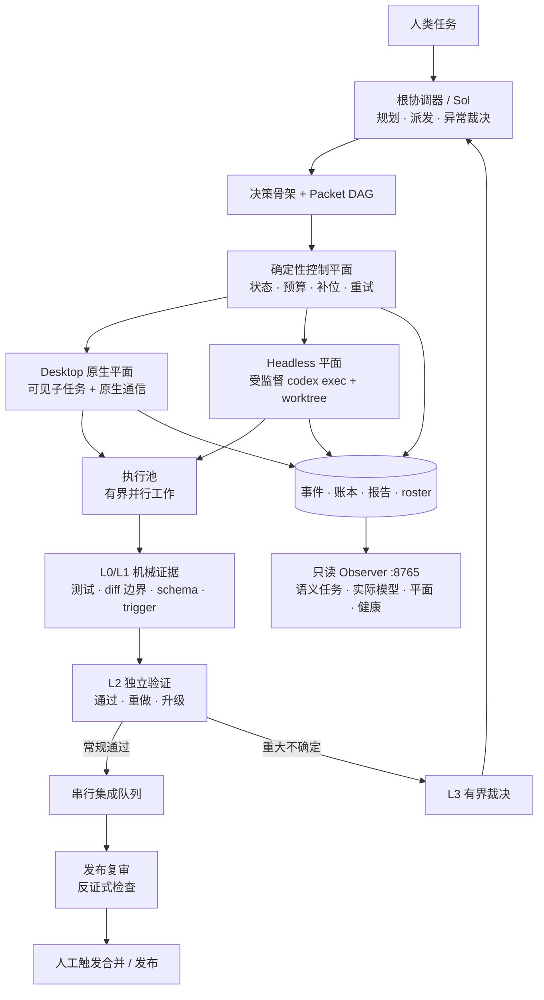
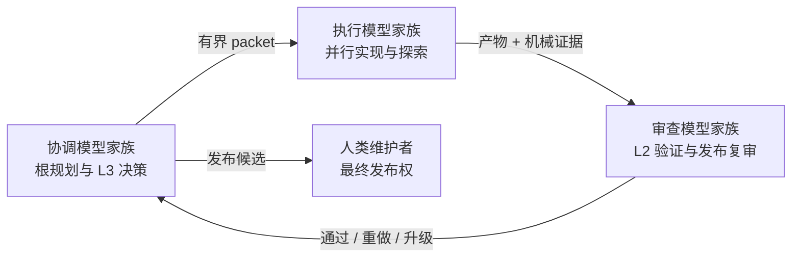

<!-- size-justified: 中文项目主页；不内联日志、清单和运行状态。 -->
<div align="center">

# Codex LOOP Orchestra

**面向高并发 Codex 智能体的多模型、双平面编排与可观测系统。**

[](https://github.com/LEO001020/codex-loop-orchestra/actions/workflows/ci.yml)
[](LICENSE)
[](https://www.python.org/)

[English](README.md) · [安装说明](INSTALL.zh-CN.md) · [安全策略](SECURITY.md) · [参与贡献](CONTRIBUTING.md)

</div>

> [!IMPORTANT]
> Codex LOOP Orchestra 是独立社区项目，不是 OpenAI 官方产品，也不代表 OpenAI 的隶属、赞助或背书。项目使用 Codex 已公开的配置、custom agents、生命周期 hooks 与 `codex exec`，不分发、不修改 Codex 二进制文件。

## 为什么需要 LOOP

Codex 已经具备子智能体和根对话—子智能体通信。LOOP 保留这些原生能力，并增加持续编排和观察层：

- **让根对话专注协调。** 根对话负责规划、派发、真正异常的裁决和最终综合；搜索、测试、等待、轮询、计数和常规重试由 worker 或确定性脚本完成。
- **持续补充有效并发。** 一次性波次会随着任务完成逐渐衰减。LOOP 只要仍有真实、有界的工作，就会计算有效并发并补充空缺槽位。
- **降低同模型错误相关性。** 执行、L2 验证和发布复审都有显式角色、模型和推理强度 pin。生产部署可以让根协调、执行池和审查层使用三个独立模型家族或供应商。
- **提供可运营的任务身份。** LOOP 把随机英文 nickname 候选改成有序的 `task_01`–`task_50`。Codex Desktop 原生 nickname 不能展示完整委派目标，因此 Observer 再增加语义任务映射。
- **分离控制平面和宽波次执行。** 维护者曾在自己的环境中观察到 10–20 个繁忙 Desktop 子任务附近出现对话层或应用不稳定。因此 LOOP 可以让 Desktop 保持轻量，将宽波次交给受监督的 headless worker。这是维护者观察到的设计动机，不是普遍的 Codex 产品断言。

LOOP 的可测量控制目标是：**根模型有效生产 token 占比不超过 25%**。这是控制目标，不是对所有环境的成本、质量或速度保证。

## 核心能力

| 能力 | 实现方式 |
|---|---|
| 持续高并发 | 每个父任务默认目标 20，双平面总目标 80，均可配置 |
| Desktop + headless | 可见的原生子任务与受监督的 `codex exec` worker 并存 |
| 实时补位 | 仍有合格任务时，完成、失败或丢失的槽位会被补充 |
| 模型隔离 | 执行与审查显式 pin；根模型仍由用户控制 |
| 确定性控制 | Packet DAG、状态机、重试分类、生命周期 roster、dead letter |
| 分层验证 | L0/L1 机械检查、L2 独立验证、L3 有界裁决、L4 人工发布 |
| 人类可读观察 | 原生有序 nickname + 8765 上的任务/模型/平面语义映射 |
| 可逆全局模式 | Activate、Deactivate、Status 与基于备份校验的 Restore |

20/80 是 LOOP 的运行目标，不是 Codex 官方限制。配置中的 Codex 单会话子线程上限是 50。

## 架构



模型角色形成的是“乐团”，不是同一模型的自我重复：



便携默认 profile 不依赖私有网关。生产 profile 可以引用用户已经在 Codex 或网关中配置好的路由模型 ID；凭据始终留在仓库之外。

## 人类可视化界面


截图来自维护者使用 provider 路由的实际部署，因此模型芯片文字由该 profile 决定；
公开版 Observer 会根据活动便携 profile 派生“执行/审查”标签。

Desktop 显示 `task_39` 之类的原生有序 nickname。只读 Observer 将它关联到语义任务名，并显示观测到的模型、执行平面、生命周期新鲜度、配置容量和网关健康。Observer 读取生命周期与 rollout 证据，不参与调度，也不能授权发布。

## 面向 Agent 的安装方式

推荐方式是：**由 Agent 引导，但由确定性脚本执行。** 把仓库交给 Codex 或其他编码 Agent，并要求它遵循 [AGENT_INSTALL.md](AGENT_INSTALL.md)：

```text
请阅读 AGENT_INSTALL.md，先询问我选择中文还是 English。
只读检查我的环境，运行仓库支持的 dry-run，解释所有计划修改和备份；
得到我确认后，只调用仓库提供的确定性安装器并机械验证结果。
不要读取、输出或修改任何 API 凭据。
```

Agent 负责识别真实环境并解释操作；PowerShell、Python 和 Bash 脚本负责实际安装与还原。用户也可以完全手工执行相同入口。

### 前置条件

- 支持 subagents 和 hooks 的 Codex CLI，并完成 `codex login`
- Python 3.11+
- Node.js 22+
- Git 2.40+
- Windows 使用 PowerShell；Linux/WSL 使用 Bash

### Windows

```powershell
git clone https://github.com/LEO001020/codex-loop-orchestra.git
cd codex-loop-orchestra
./launchers/Set-Codex-LOOP-Mode.ps1 -Mode Activate
```

Activate 会安装便携 custom agents、合并受支持的 Codex 多智能体设置、备份托管文件、渲染绝对 hook 路径，并开启全局 LOOP 模式。完成后完全退出并重启 Codex Desktop，再新建任务。

```powershell
# 可选：启动工作区和 Observer
./launchers/Start-Codex-LOOP-Desktop.ps1 -TargetWorkspace C:\path\to\repo
./launchers/Start-Codex-LOOP-Monitor.ps1

# 暂停，不删除已验证备份
./launchers/Set-Codex-LOOP-Mode.ps1 -Mode Deactivate

# 恢复安装前的托管文件
./launchers/Set-Codex-LOOP-Mode.ps1 -Mode Restore
```

### Linux / WSL

```bash
git clone https://github.com/LEO001020/codex-loop-orchestra.git
cd codex-loop-orchestra
./install.sh --repo "$PWD"
```

重启 Codex 并新建任务。恢复激活前的托管文件：

```bash
./uninstall.sh
```

隔离测试安装、显式 `CODEX_HOME`、模型 profile、headless 前提和故障排查见 [INSTALL.zh-CN.md](INSTALL.zh-CN.md) 与 [INSTALL.md](INSTALL.md)。

## 配置边界

安装器只合并 `config/config.toml.example` 中受支持的 Codex 设置：

```toml
[features]
multi_agent = true

[agents]
enabled = true
max_concurrent_threads_per_session = 50
default_subagent_model = "gpt-5.6-terra"
default_subagent_reasoning_effort = "medium"
```

官方参考：[Subagents](https://learn.chatgpt.com/docs/agent-configuration/subagents)、[Hooks](https://learn.chatgpt.com/docs/hooks) 与 [Configuration Reference](https://learn.chatgpt.com/docs/config-file/config-reference)。

| 文件 | 唯一职责 |
|---|---|
| `config/model_profiles.toml` | 执行与独立审查的模型 pin |
| `config/refill_policy.toml` | 父任务/双平面目标、节流与低水位 |
| `config/orchestration_policy_v2.toml` | 路由、预算、governor 与模型家族 pin |
| `config/retry_classes.yaml` | 确定性重试与 dead-letter 分类 |
| `config/triggers_v2.yaml` | 机械升级信号 |
| `agents/*.toml` | custom agent 指令、sandbox 与有序 nickname 候选 |

在不触碰用户凭据的情况下检查或切换仓库内 profile：

```bash
python harness/model_profile.py list --root .
python harness/model_profile.py set portable --root . --no-global --no-wsl
```

`three-family-example` 默认不激活。先把占位符替换成当前 Codex 或网关已经提供的模型 ID，让根对话使用第三个独立家族，再启用该 profile。切换器不会改写 provider catalog 或凭据。

## 控制循环

1. 根对话输出有界决策骨架，不亲自做批量工作。
2. 每个 packet 声明目标、授权路径、验收命令和约束。
3. DAG 门在派发前拒绝循环依赖和波次内写路径冲突。
4. Desktop 或 headless worker 在独立 worktree 中运行，并显式 pin 角色、模型和推理强度。
5. 脚本回放验收、检查 diff 边界并写入类型化生命周期事件。
6. L2 可以通过、要求重做、排序候选或升级，但不能发布。
7. 只有真正异常回到根对话；最终合并和发布始终由人触发。

等待、轮询、计数、常规重试和状态迁移由脚本或状态机处理，不额外消耗根模型轮次。

## 目录结构

```text
agents/      Codex 角色与有序 nickname 候选
config/      路由、并发、重试、触发器与托管 hook 策略
harness/     派发、状态机、补位、生命周期、门禁与恢复
hooks/       Codex 生命周期强制与上下文注入
launchers/   Windows 激活、Desktop 启动与 Observer
metering/    按角色/模型进行 token 归因和预算控制
schemas/     packet 与报告契约
scripts/     发布打包和完整性工具
tests/       单元、状态路径、安装器、安全与编排测试
```

运行状态只能写入 `data/`，报告写入 `reports/`；两者都被忽略，绝不能提交到 GitHub。

## 验证

```bash
python -m pytest tests -q
python scripts/gen_filelist.py .
python scripts/gen_sha256sums.py . --output SHA256SUMS
sha256sum -c SHA256SUMS
```

CI 检查源码和配置语法、指令注意力预算、PowerShell 解析、隔离安装、托管文件闭包和秘密泄露。真实 provider 路由只作为显式本地 smoke test，因为公共 CI 不含用户凭据。

## 安全与限制

- hooks 以当前用户身份运行，不提升权限。
- provider 凭据留在用户自己的 Codex 或网关认证中。
- 工具门和 spawn 门只会拒绝操作，不会授予额外权限。
- L1/L2 可以阻止或升级，只有人类能够发布。
- 20/80 与根 token 25% 都是可配置 LOOP 策略，不是保证或 Codex 官方限制。
- 当前实现是单机控制平面，不是分布式调度器。

安全问题请按 [SECURITY.md](SECURITY.md) 私下报告。

## 历史与许可证

LOOP 的最初设计早于当前 Codex harness 能力被广泛作为开源实现提供。公开版本建立在文档化扩展面之上，不维护 Codex 二进制 fork。

MIT © 2026 [LEO001020](https://github.com/LEO001020)。详见 [LICENSE](LICENSE)、[CONTRIBUTING.md](CONTRIBUTING.md) 和 [THIRD_PARTY_NOTICES.md](THIRD_PARTY_NOTICES.md)。
