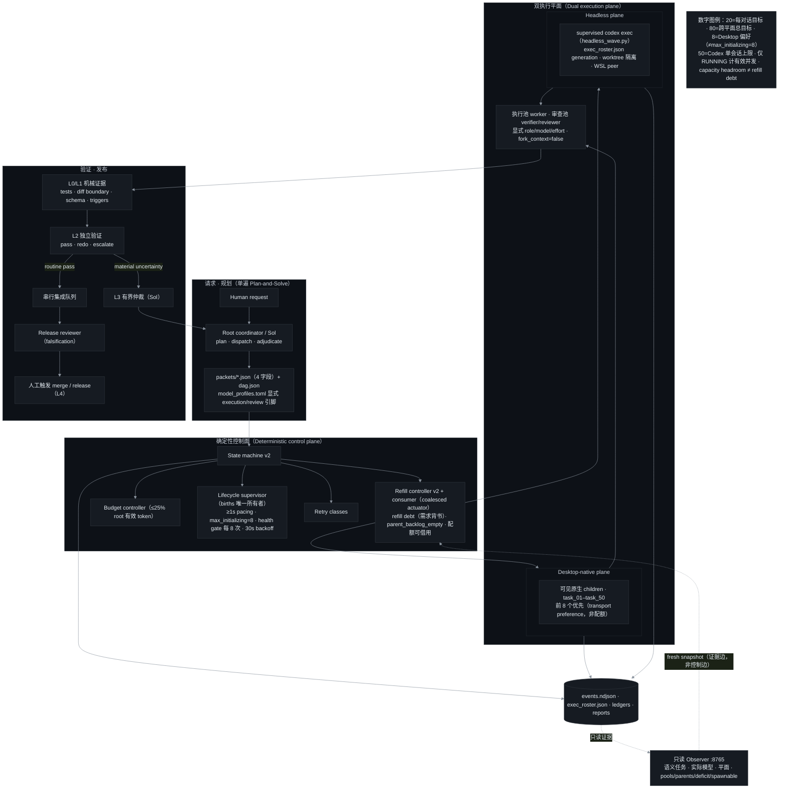

# 并发补位表达 — Codex LOOP Orchestra 静态总架构图设计报告

包目标：设计一张比现有 README Mermaid 图更有说明性的静态总架构图（最终用于 GitHub README），
必须准确表达 20/80、Desktop 8 transport preference、headless sustained refill、50 session ceiling。
本包为只读分析；仓库 `E:\codex-LOOP\github\codex-loop` 未被修改。

## 1. 证据索引（术语来源）

| 术语 | 来源 | 关键行 |
|---|---|---|
| 20 = dialogue_target，80 = target_total，1s spawn 间隔，max_initializing=8，health_gate_every=8，30s backoff | `config/refill_policy.toml` | `[concurrency]`、`[spawn_throttle]` |
| 50 = Codex 单会话子线程上限 | `config/config.toml.example` | `max_concurrent_threads_per_session = 50` |
| "前 8 个孩子 Desktop-native，其余 headless；8 是 transport preference 非并发上限；原生出生仅在该任务已 durable 提交 headless 并稳定观察为 running 后才能被阻止" | `config/global_working_agreement.md` | L36-40 |
| 只读 Observer :8765：语义任务·实际模型·平面·健康；pools/parents/deficit/spawnable；capacity headroom ≠ refill debt；parent_backlog_empty | `launchers/loop_monitor_server.py` | L956-966 附近、`refill_controller_v2.py` L523 |
| exec_roster.json、generation、starting/running、只有 RUNNING 是有效并发 | `harness/headless_wave.py` | L45、L174、L576 |
| births 由 lifecycle supervisor 拥有 | `harness/lifecycle_supervisor.py` | L135-182 |
| refill debt 是需求背书的；consumer 是 mechanical actuator；observer fresh snapshot 是跨平面权威（证据边，非控制边） | `harness/refill_consumer_v2.py`、`refill_controller_v2.py` | L72、L348-363、L956 |
| 父级补位清单 schema `codex-loop-parent-refill/v1`、target_active | `harness/parent_manifest_importer.py` | L139、L155 |
| worker/verifier/reviewer 角色、task_01–task_50 nickname 候选 | `agents/*.toml` | worker.toml |
| 现有 README 图（EN + zh-CN 同构） | `README.md` L47-73、`README.zh-CN.md` L47-74 | flowchart TB + flowchart LR |

## 2. 设计结论（五层 + 观测侧栏）

采用"自上而下五层卡片带 + 右侧只读观测栏"的暗色分层结构，替代现有单链式 flowchart：

1. **请求·规划层** — Human request → Root coordinator/Sol（仅 plan/dispatch/adjudicate）
   → 单遍 Plan-and-Solve：`packets/*.json`（4 字段）+ `dag.json`；模型路由 `model_profiles.toml`
   （execution/review 显式引脚，worker/verifier/reviewer agent_type，fork_context=false）。
2. **确定性控制面** — State machine v2；Refill controller v2 + consumer（coalesced actuator；
   refill debt 需求背书；parent_backlog_empty；reservations borrowable）；Budget controller
   （≤25% root 有效 token 占比）；Retry classes；Lifecycle supervisor（births 唯一所有者：
   ≥1s pacing、max_initializing=8、health gate 每 8 次出生、30s backoff、exec_roster.json 世代）。
3. **双执行平面** — Desktop-native plane（可见原生 children、task_01–task_50 有序 nickname、
   前 8 个优先=transport preference 非配额；原生出生被阻止≠refill 债务清除）
   ‖ Headless plane（supervised `codex exec` via `headless_wave.py`、worktree 隔离、
   LOOP_EXECUTION_PLANE、WSL peer、roster generation）。两平面汇入执行池（worker）与
   审查池（verifier/reviewer），全部带显式 role/model/effort 引脚。
4. **验证·发布层** — L0/L1 机械证据（tests/diff boundary/schema/triggers）→ L2 独立验证
   （pass/redo/escalate）→ 常规 pass 走串行集成队列 → release reviewer（falsification）
   → 人工触发合并/发布（L4）；material uncertainty → L3 有界仲裁（回 Sol）。
5. **观测侧栏（只读）** — Observer :8765：语义任务、实际模型、平面、pools/parents/deficit/
   spawnable、新鲜度；读取 lifecycle/rollout 证据；虚线"证据边"回 Refill controller
   （fresh snapshot 作跨平面权威），但绝无调度/授权边。

### 数字标注（图内必须精确区分四种语义）

| 数字 | 语义 | 图注写法 |
|---|---|---|
| 20 | 每对话/父任务运行目标（dialogue_target） | "目标，非 Codex 保证" |
| 80 | 跨对话跨平面总目标（target_total） | "目标，非 Codex 保证" |
| 8 | Desktop transport preference（前 8 个原生） | "偏好，非并发上限；≠ max_initializing" |
| 50 | Codex 单会话子线程上限（max_concurrent_threads_per_session） | "配置上限；root 不计入" |

另注：`max_initializing=8`（初始化握手上限）与"Desktop 前 8 个"同数字不同机制，图中不得混写；
`task_50` nickname 候选与 50 上限也是巧合数字，不构成因果。

## 3. 草案 Mermaid（暗色主题变量，可直接进 README）

## 4. 实施建议

- 首选 **Mermaid 暗色主题 + 五层 subgraph**：零新增资产、随 README 同步、EN/zh-CN 两版共用同一源。
- 若要与用户参考的暗色卡片图视觉一致，再生成一张深底 PNG（如 `docs/assets/architecture-dark.png`）
  作展示图，Mermaid 源保留为可维护版本；深底 PNG 在 GitHub 浅色主题下亦不违和。
- 图下加一行 caption 引用 `config/refill_policy.toml` 与 `config/config.toml.example` 为数字出处。

## 5. 风险与注意

1. **数字语义混淆（最高风险）**：8 有三个候选含义——Desktop transport preference、
   max_initializing、health_gate_every；50 与 task_50 亦是巧合。图注必须逐项区分。
2. **固定分配误解**：不得画成"8 native + 72 headless"；8 是偏好、20/80 是目标而非配额/保证。
3. **Observer 只读性**：refill controller 确实消费 observer snapshot，但这是证据边；图中只能画
   虚线单向，避免被误读为调度回路。
4. **v4=60/k3=20 保留配额**：属本部署 fork 私有策略，README 公开图不应出现；若提及只能说
   "borrowable reservations"。
5. **Mermaid 深色主题在浅色 GitHub 主题下的可读性**：themeVariables 随 `theme: base` 生效于两态；
   如不满意，改走深底 PNG 资产。
6. **参考图不可见**：用户参考的分层暗色卡片图不在仓库/会话内，本设计按"分层暗色卡片"文字描述
   推断；若参考图有特定版式（泳道方向、卡片字段、装饰元素），需再对齐一次。
